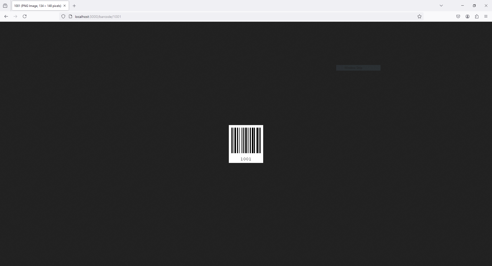

# Creating a Barcode API with Node.js - Using jsbarcode
 
To install the necessary dependencies for your Express server that generates barcodes, you can use the following command:

Here's a brief description of each package:

- `express`: The web framework for handling HTTP requests and responses.

```
npm i express
```

- `canvas`: A library for creating and manipulating canvas elements.

```
npm i canvas 
```

- `jsbarcode`: A library for generating barcodes.

```
npm i jsbarcode
```

`.env`
```
PORT=3000
```

`.server.js`
```
const express = require('express');
const { createCanvas } = require('canvas');
const Barcode = require('jsbarcode');

const app = express();

const PORT = process.env.PORT || 3000;

// Create a barcode endpoint
app.get('/barcode/:text', (req, res) => {
    // Extract the text parameter from the URL
    const barcodeText = req.params.text;

    // Print the extracted text to the console
    console.log(barcodeText);

    // Create Canvas
    const canvas = createCanvas();

    Barcode(canvas, req.params.text, {
        format: 'CODE128',
        displayValue: true,
        fontSize: 18,
        textMargin: 10
    });

    res.type('image/png');

    const stream = canvas.createPNGStream();

    stream.pipe(res);

    // Send a response to the client (optional)
    // res.send(`Barcode text received: ${barcodeText}`);
});

app.listen(PORT, () => {
    console.log(`Server is running on port ${PORT}`);
});
```

`postman`

GET -> http://localhost:3000/barcode/1001

